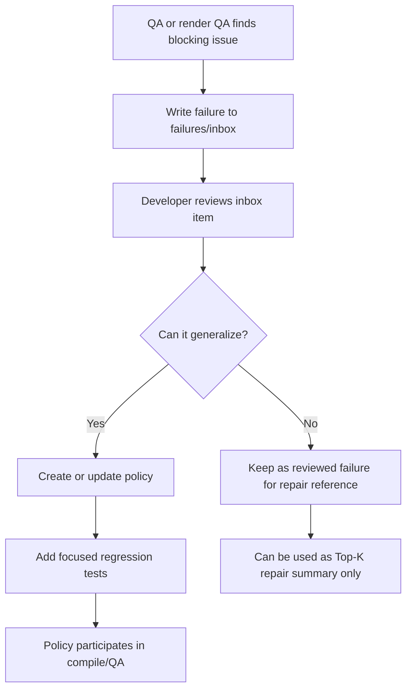
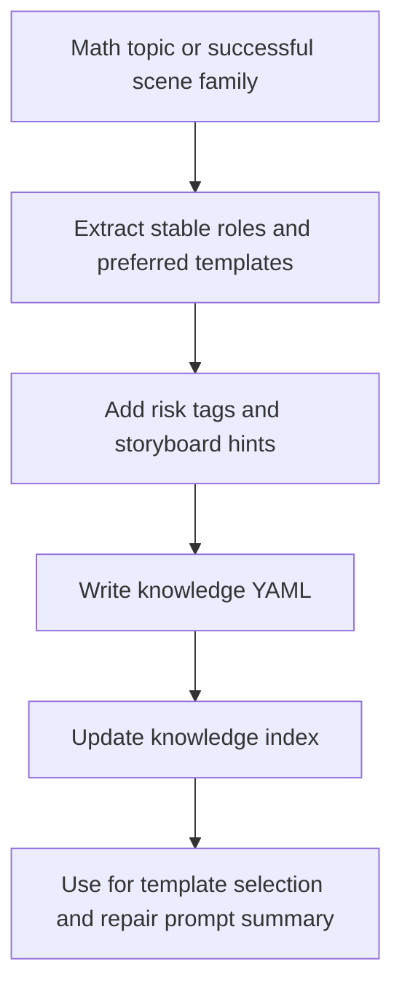
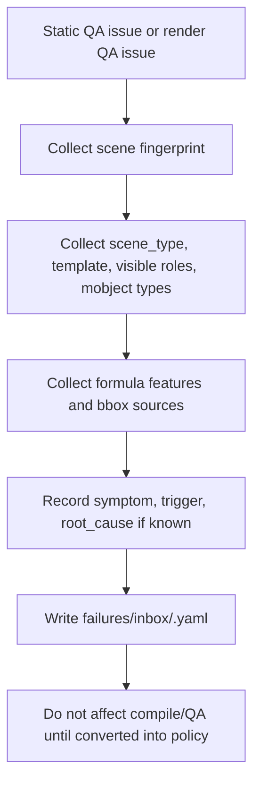
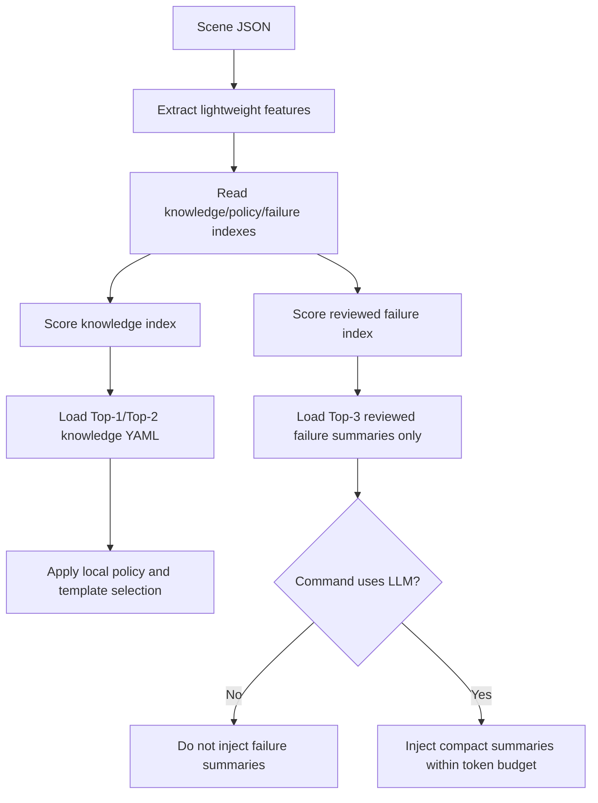

# Layout QA Stabilization and Future Template/Memory PRD

## 1. Background

Recent derivative-geometry renders exposed a recurring class of layout failures:

- Static QA can pass while the rendered frame still has text or formula overlap.
- `Tex` bounding boxes are estimated with a simple heuristic, so tall formulas such as `\lim` plus `\frac` are underestimated.
- Existing slots are center points plus rough safe regions. They do not behave like true non-overlapping layout containers.
- The compiler currently fits `Text`/`Tex` to slot width only. It does not fit to slot height or reject content that cannot fit.
- Different math topics need different layout structures, but generated scenes may not always match known templates.

The immediate symptom was a derivative formula overlapping the caption and plot area after being moved to `bottom_formula`.

The exact current-code bug is concrete:

- `bottom_formula` and `caption` safe regions overlap by design in `manim_cli/dsl/layout.py`.
- `bottom_formula` occupies roughly `y in [-0.40h, -0.26h]`.
- `caption` occupies roughly `y in [-0.49h, -0.37h]`.
- These regions overlap around `[-0.40h, -0.37h]`.
- `emit_layout()` fits width only, so tall formulas can still overflow vertically.
- `Tex` static bbox uses a flat font-size heuristic, so `\lim` plus `\frac` formulas are underestimated.
- `unknown_static` confidence currently degrades risky objects into visual-QA warnings instead of strict blocking layout failures.

The deeper product issue is that Manim CLI needs a reliable layout QA foundation first. Template selection and failure memory are useful follow-ons, but they should not block the immediate fix.

## 2. Product Goal

Make generated math videos harder to ship with visual layout defects by delivering a focused MVP first.

MVP goal, System A:

1. Make core layout regions non-overlapping.
2. Fit `Text`/`Tex` to both width and height.
3. Use measured TeX bbox when available.
4. Use conservative formula height estimates when probing is unavailable.
5. Promote unsafe unknown/static formula bbox cases to blocking issues in strict/final profiles.
6. Keep existing scene JSON compatible.

Follow-on goal, System B:

1. Add explicit layout templates.
2. Add optional layout roles.
3. Add deterministic fallback templates.

Deferred design/RFC, System C:

1. Add knowledge files.
2. Add reviewed failure memory.
3. Add policy persistence and Top-K retrieval for repair/generation.

The intended tradeoff is acceptable: generated videos may look more templated, but they should be significantly less likely to contain overlapping formulas, captions, plots, labels, or annotations.

## 3. Non-Goals

- Do not build a full constraint solver in the first release.
- Do not require every existing scene to be migrated immediately.
- Do not depend on an LLM call during `compile`, `qa`, or `render`.
- Do not implement semantic template auto-classification in the MVP.
- Do not implement failure-memory persistence in the MVP.
- Do not implement automatic frame splitting in the MVP.
- Do not make templates overly decorative or topic-specific beyond what is needed for robust layout.

## 4. Users and Use Cases

Primary users:

- Authors generating math explainer scenes from structured JSON.
- Agents repairing failed scenes automatically.
- Developers maintaining layout and QA rules.

Core use cases:

- Generate a derivative-geometry scene where plot, tangent, formula, and conclusion do not overlap.
- Generate a geometry proof scene where diagram and proof steps remain separated.
- Generate algebra derivations where formulas fit vertically or split into multiple frames.
- Run `qa --profile strict` and receive actionable layout errors before rendering.
- Re-run generation after a known failure and avoid repeating the same layout defect.

## 5. Design Principles

- MVP work should first fix deterministic layout correctness in the current slot system.
- Templates are starting strategies, not the whole solution.
- Semantic scene type and visual layout are separate concerns, but semantic auto-classification is deferred.
- Objects may later declare roles such as `plot.primary`, `formula.primary`, and `caption.conclusion`; the compiler should decide exact placement.
- Unknown or low-confidence bounding boxes must not pass silently in strict/final profiles.
- A scene that cannot fit safely should fail strict QA before render. Later releases may split content across frames.
- QA should block unsafe output before render whenever possible.
- Failure memory should mostly drive local policy, not long prompt injection, and is deferred from the MVP.

## 6. MVP Scope: System A

System A fixes the motivating bug without introducing a new DSL.

Required changes:

- Adjust built-in `bottom_formula` and `caption` safe regions so they do not overlap.
- Apply height-aware fit for `Text` and `Tex` in `emit_layout()`.
- Wire `render/bbox_probe.py` into layout QA or compile-time layout planning when available.
- Add conservative formula-height estimation for `Tex` when measured bbox is unavailable.
- Make unsafe `unknown_static` formulas blocking in strict/final profiles when they are near protected regions.
- Add focused regression tests for formula/caption overlap, formula/plot overlap, measured bbox integration, and unknown bbox behavior.

### 6.1 Unknown Static Policy

Current behavior allows risky static estimates to degrade into non-blocking visual-QA warnings. MVP behavior should be explicit:

```text
strict/final profile:
  Text/Tex with unknown_static bbox
  + intersects or could intersect protected region
  -> blocking issue

default profile:
  Text/Tex with unknown_static bbox
  + intersects or could intersect protected region
  -> warning with visual-QA hint
```

Protected regions include plot, formula, caption, and title regions. Plot-attached geometry remains exempt where explicitly allowed by existing overlap logic.

### 6.2 Conservative Formula Height

When measured bbox is unavailable, formula height must be biased high:

```text
base_height = font_size * 0.018

if contains \frac:
  height *= 1.8

if contains \lim, \sum, \prod, or \int with limits:
  height *= 1.4

if contains matrix/cases/aligned:
  height *= max(1.5, estimated_line_count * 0.9)

if nested fractions are detected:
  height *= 1.25 per additional nesting level
```

These multipliers are intentionally conservative. They should be tested against representative formulas and refined after measured bbox integration.

### 6.3 Schema Compatibility

The repository models currently reject unknown fields. Therefore, MVP must not require `layout_role` or `layout_template` fields.

Follow-on DSL additions require one of these compatibility strategies:

- Add a scene schema version and only allow new fields for that version.
- Add optional fields to current models while preserving existing behavior.
- Add a migration command that rewrites legacy scenes.

Until that work is done, new template fields are design-only and must not be required by generated examples.

## 7. Follow-On DSL Shape: System B

Minimal future form:

```json
{
  "layout_template": "plot_with_bottom_formula",
  "mobjects": [
    {
      "id": "axes",
      "type": "Axes",
      "layout_role": "plot.axes"
    },
    {
      "id": "curve",
      "type": "FunctionGraph",
      "layout_role": "plot.primary"
    },
    {
      "id": "limit_formula",
      "type": "Tex",
      "layout_role": "formula.primary"
    },
    {
      "id": "conclusion",
      "type": "Text",
      "layout_role": "caption.conclusion"
    }
  ]
}
```

More explicit form for later releases:

```json
{
  "layout_template": {
    "name": "plot_with_bottom_formula",
    "density": "standard",
    "formula_policy": "auto_split",
    "fallbacks": [
      "plot_with_side_formula",
      "plot_then_formula",
      "formula_then_caption"
    ]
  }
}
```

`layout.slot` remains supported for backward compatibility, but new generated scenes should prefer `layout_role`.

## 8. Template System

### 8.1 Semantic Templates

Semantic templates describe the teaching situation and expected object roles:

- `derivative_geometry`: plot, moving point, secants, tangent, final derivative formula.
- `algebra_derivation`: formula sequence, transformation relation, optional explanation caption.
- `function_graph_explanation`: axes, graph, labels, callouts, optional formula.
- `geometry_proof`: diagram, knowns, proof steps, conclusion.
- `vector_coordinate_geometry`: coordinate plane, vectors, projections, component labels.
- `statistics_chart_explanation`: chart, legend, summary statement.
- `definition_examples`: title, formal definition, one or more examples.

Semantic templates answer: what objects should exist and which roles do they play?

MVP decision: do not ship automatic semantic template classification. A future generator may pass `layout_template` explicitly.

### 8.2 Layout Templates

Layout templates describe how roles can be placed:

- `plot_full`
  - One large plot region.
  - Allows attached labels and callouts.
  - Disallows large bottom formulas.

- `plot_with_bottom_formula`
  - Plot region above.
  - Formula region below.
  - Caption is optional and must not overlap formula.

- `plot_with_side_formula`
  - Plot on one side, formula or explanation on the other.
  - Better for wide or tall formulas than bottom placement.

- `plot_then_formula`
  - First frame emphasizes plot.
  - Later frame fades or shrinks plot and shows formula.

- `formula_then_caption`
  - Formula and conclusion appear in separate steps or frames.
  - Useful when both are important but cannot fit together.

- `vertical_derivation`
  - Full frame for vertical formulas.
  - No plot.
  - Supports step-by-step formula replacement or stacking.

- `diagram_left_proof_right`
  - Diagram on left.
  - Proof or explanation stack on right.

- `coordinate_plane_with_callouts`
  - Coordinate region with attached callouts.
  - Side or bottom region reserved for equations.

- `chart_with_caption`
  - Chart region, legend region, caption or insight region.

- `title_definition_examples`
  - Title/definition region.
  - Examples below.

Layout templates answer: how should the roles be arranged?

## 9. Template Mismatch and Safe Fallback

Templates will never cover every data shape. The system must assume mismatch is normal.

If a scene does not confidently match a known semantic template, or the selected layout cannot fit, the compiler should fall back deterministically:

```text
scene intent
  -> choose semantic template
  -> assign layout roles
  -> choose initial layout template
  -> measure or conservatively estimate object bboxes
  -> try fitting into template regions
  -> if fit fails, try fallback layout variants
  -> if variants fail, split into multiple frames
  -> if splitting is not allowed, block with actionable QA errors
```

`safe_default` rules:

- One primary visual region per frame.
- Large formulas get their own frame.
- Caption and large formula do not appear in the same frame unless measured bboxes prove safety.
- Plot annotations must be attached to a target object.
- Unknown formula bbox blocks final render in strict/final profiles.
- If too many visible objects exist, split the step.

This gives uncommon math problems a reliable fallback instead of free-form object placement.

### 9.1 Frame Splitting Dependency

Frame splitting is not a pure layout operation. It changes storyboard timing and visible object sets.

Before automatic splitting can ship, the system needs:

- a step/scene operation that can clone or divide an existing step.
- a way to preserve narration/caption timing or explicitly mark changed timing.
- compile diagnostics that show which objects moved to the new frame.
- QA warnings when fallback changes the storyboard.

MVP decision: if a frame cannot fit safely, strict QA should block with repair hints instead of auto-splitting.

## 10. Deferred RFC: Knowledge, Failure Memory, and Policy

### 10.1 Why This Is Needed

Templates solve normal layout cases. Failure memory solves repeated abnormal cases.

Without memory, the CLI may repeatedly generate scenes that technically satisfy the current schema but reproduce known visual failures. With memory, each blocking QA or render failure can become a reusable prevention rule.

### 10.2 Core Separation

The system should separate stable domain knowledge, concrete failure evidence, executable policy, and layout templates.

```text
Knowledge
  Stable math/layout facts, preferred templates, common roles, and risk tags.

Failure Memory
  Concrete historical failures with symptoms, triggers, root cause, avoidance, and short summaries.

Policy
  Executable rules that can be evaluated locally during compile/QA.

Template
  Layout blueprint: regions, role mapping, spacing, and fallback order.
```

This separation prevents one failure case from incorrectly rewriting general layout behavior.

Mental model:

```text
Template = layout blueprint
Policy = safety law
Knowledge = domain preference
Failure Memory = evidence
```

### 10.3 What Goes Into Knowledge

Knowledge stores stable domain preferences. It should not contain concrete scene coordinates, raw failure logs, long prompts, or executable safety rules.

Good knowledge fields:

- scene type definition.
- common role set.
- preferred template order.
- content-scale-dependent template preferences.
- risk tags.
- storyboard hints.
- short prompt summary for generation/repair.

Bad knowledge fields:

- exact coordinates for a single example.
- screenshot analysis.
- complete scene JSON examples.
- rules that should block/fallback during QA.
- long natural-language prompt bodies.

Example:

```yaml
id: derivative_geometry
version: 1
description: Geometric meaning of derivative using curve, secant, tangent, and limit formula.
match:
  topic_keywords:
    - derivative
    - tangent
    - secant
    - slope
  formula_features:
    - derivative_notation
    - limit_difference_quotient
  mobject_types:
    - Axes
    - Line
    - Dot
    - Tex
required_roles:
  - plot.axes
  - plot.primary
  - formula.primary
optional_roles:
  - plot.point
  - plot.line
  - annotation.attached
  - caption.conclusion
preferred_templates:
  default:
    - plot_with_bottom_formula
    - plot_with_side_formula
    - plot_then_formula
  if_formula_is_tall:
    - plot_with_side_formula
    - plot_then_formula
    - formula_then_caption
  if_many_annotations:
    - plot_full
    - plot_then_formula
risk_tags:
  - tall_formula
  - formula_caption_collision
  - formula_plot_collision
  - dense_plot_annotations
storyboard_hints:
  - Show curve and point first.
  - Introduce secant before tangent.
  - Reveal final derivative formula after geometric intuition.
  - Avoid showing large final formula and conclusion caption in the same tight bottom region.
prompt_summary: >
  Derivative geometry scenes need a plot region for curve/secant/tangent and
  a separate formula region for the final limit expression. If the formula is
  tall, prefer side formula or split-frame layouts.
```

### 10.4 What Goes Into Failure Memory

Failure memory stores concrete evidence. It should not directly affect `compile` or `qa`; it becomes executable only after being promoted into a policy.

All newly recorded failures should land in `failures/inbox/`. Human-reviewed examples can move to `failures/reviewed/`. The system should not use `hot/warm/cold` in the MVP; that tiering is unnecessary until there is a large multi-team memory corpus.

Example:

```yaml
failure_id: derivative_formula_caption_overlap_2026_07
created_at: "2026-07-14T00:00:00Z"
scene_type: derivative_geometry
symptom: formula overlaps caption and x-axis
trigger:
  formula_contains:
    - "\\lim"
    - "\\frac"
  layout_template: plot_with_bottom_formula
  visible_roles:
    - plot.axes
    - formula.primary
    - caption.conclusion
root_cause:
  - tex_bbox_estimate_too_small
  - bottom_formula_and_caption_regions_too_close
  - compiler_only_scaled_width_not_height
avoidance:
  - require_measured_tex_bbox
  - reserve_min_formula_height: 1.25
  - split_formula_and_caption_if_needed
severity: blocking
confidence: high
prompt_summary: >
  Tall derivative limit formula with \lim+\frac overlapped caption and x-axis
  in plot_with_bottom_formula; reserve more formula height or split formula and caption.
```

### 10.5 What Goes Into Policy

Policy stores executable rules. A candidate should enter policy only when it is:

- Observable: the CLI can detect the condition from scene JSON, formula features, bbox, or QA issues.
- Deterministic: the same input gives the same decision.
- Actionable: the CLI can `allow`, `block`, `enforce`, `fallback`, or emit diagnostics.
- Testable: the behavior can be covered by unit or regression tests.
- Low false-positive risk: the rule should not unnecessarily degrade normal scenes.

Policy types:

- `allow`: explicitly permit safe overlap and reduce false positives.
- `block`: reject known unsafe layouts.
- `enforce`: require dimensions, gaps, bbox confidence, or font size.
- `fallback`: select replacement templates when the current plan is unsafe.
- `diagnostic`: produce better error messages without changing layout.

Example:

```yaml
policy_id: tall_formula_bottom_region_safety
type: enforce
when:
  formula_contains_any:
    - "\\frac"
    - "\\lim"
    - "\\sum"
    - "\\int"
  role: formula.primary
  region: bottom_formula
enforce:
  min_region_height: 1.25
  measured_bbox_required_in_final: true
  min_caption_gap: 0.35
fallback:
  - formula_then_caption
  - plot_with_side_formula
  - plot_then_formula
tests:
  - test_tall_formula_bottom_region_requires_extra_height
  - test_tall_formula_bottom_region_falls_back_when_caption_visible
```

Counterexamples that should not enter policy:

- Move one specific object from `y=-3.1` to `y=-2.7`.
- Always ban `bottom_formula`.
- Use a rule that depends on visual taste but has no detectable input condition.
- Use low-confidence screenshot analysis without root cause.

### 10.6 Persistence and Storage Layout

These artifacts must not be removed by CLI package upgrade or uninstall. Built-in defaults and user/project data should be stored separately.

Recommended layout:

```text
built-in package data:
  manim_cli/builtin_layout_memory/
    knowledge/
    policies/
    templates/

project data:
  .manim-cli/layout_memory/
    knowledge/
    policies/
    failures/
      inbox/
      reviewed/
    cache/
    index.json

user data:
  ~/.manim-cli/layout_memory/
    knowledge/
    policies/
    failures/
      inbox/
      reviewed/
    cache/
    index.json
```

Read precedence:

```text
built-in < user < project < scene inline config
```

Write policy:

- failure record: default to project `failures/inbox/`.
- reviewed failure: project by default, user only with `--scope user`.
- custom policy: project by default, user only with `--scope user`.
- built-in package data: read-only.

`pip uninstall manim-cli` must not delete `.manim-cli/` or `~/.manim-cli/`.

Index files should contain only metadata required for filtering. They should not contain long failure bodies.

Knowledge index example:

```json
{
  "version": 1,
  "items": [
    {
      "id": "derivative_geometry",
      "path": "knowledge/derivative_geometry.yaml",
      "keywords": ["derivative", "tangent", "secant", "slope"],
      "formula_features": ["derivative_notation", "limit_difference_quotient"],
      "mobject_types": ["Axes", "Line", "Dot", "Tex"],
      "roles": ["plot.axes", "plot.primary", "formula.primary"],
      "priority": 90
    }
  ]
}
```

Reviewed failure index example:

```json
{
  "version": 1,
  "items": [
    {
      "id": "derivative_formula_caption_overlap_2026_07",
      "path": "failures/reviewed/derivative_formula_caption_overlap_2026_07.yaml",
      "scene_type": "derivative_geometry",
      "layout_template": "plot_with_bottom_formula",
      "roles": ["plot.axes", "formula.primary", "caption.conclusion"],
      "formula_features": ["tex.frac", "tex.lim"],
      "issue_types": ["layout_formula_caption_overlap"],
      "severity": "blocking",
      "confidence": "high"
    }
  ]
}
```

### 10.7 Generation and Promotion Flow



Policy generation should be explicit in the MVP:

```text
failure evidence -> reviewed failure -> policy candidate -> tests -> active policy
```

The system should not auto-promote arbitrary failures into policy until there are enough repeated examples and false-positive monitoring.

### 10.8 Future CLI Surface

Memory commands are not required for the MVP. If System C ships later, it should expose explicit commands rather than hidden side effects.

Candidate commands:

```bash
manim-cli memory list --scope project --kind failures
manim-cli memory inspect <failure_id>
manim-cli memory record scene.json --issue <issue_id> --scope project
manim-cli memory review <failure_id>
manim-cli memory promote <failure_id> --to-policy --scope project
manim-cli memory rebuild-index --scope project
manim-cli memory clean --scope project --inbox --older-than 90d
```

Rules:

- `record` writes to `failures/inbox/`.
- `review` moves an inbox item to `failures/reviewed/`.
- `promote --to-policy` creates a policy candidate, not an active policy unless tests are added.
- `clean` must never delete project or user memory without explicit scope and filters.

### 10.9 Knowledge Generation Flow

Knowledge can be created from planned scene categories, successful reviewed scenes, or repeated repair patterns. It should be compact and indexed.



Knowledge update checklist:

- Does it describe a scene family, not a single scene?
- Does it avoid exact coordinates?
- Does it keep executable constraints in policy?
- Does it include a short `prompt_summary`?
- Is it discoverable through `knowledge/index.json`?

### 10.10 Failure Memory Generation Flow

Failure memory should be generated from structured QA output, not free-form screenshots alone.



## 11. Cost and Performance Model

Failure memory must not become a token or runtime burden.

### 11.1 Default Rule

Do not send full memory files to the LLM during normal CLI commands.

Instead:

- `compile`: local knowledge/policy matching only.
- `qa`: local knowledge/policy matching only.
- `render`: use the final layout plan; no LLM call.
- `generate` or `repair`: inject only a short Top-K memory summary if an LLM is already being used.

### 11.2 Expected Overhead

Target overhead:

```text
compile / qa:
  token: 0
  time: +5ms to +50ms

generate / repair:
  token: +100 to +500
  time: dominated by the existing LLM call

record failure memory:
  token: 0 by default
  time: +10ms to +100ms
```

### 11.3 Retrieval Strategy

Use structured matching before semantic or LLM-based retrieval. The CLI should always load indexes first and open only selected files.

```text
scene_type
layout_template
visible_roles
mobject_types
formula_features
previous_issue_types
```

Only the top 1 to 2 knowledge files and top 3 reviewed failure summaries should be loaded for generation/repair. `compile` and `qa` should load policies and knowledge metadata, not failure records.

### 11.4 Top-K Algorithm

Feature extraction:

```json
{
  "scene_type": "derivative_geometry",
  "layout_template": "plot_with_bottom_formula",
  "mobject_types": ["Axes", "Line", "Dot", "Tex"],
  "roles": ["plot.axes", "plot.primary", "formula.primary", "caption.conclusion"],
  "formula_features": ["limit_difference_quotient", "tex.frac", "tex.lim"],
  "issue_types": ["layout_formula_caption_overlap"]
}
```

Knowledge scoring:

```text
score =
  keyword_match_count * 3
  + formula_feature_match_count * 5
  + mobject_type_match_count * 1
  + role_match_count * 2
  + priority / 10
```

Failure scoring:

```text
score =
  scene_type_match * 5
  + layout_template_match * 4
  + role_overlap_count * 2
  + formula_feature_match_count * 3
  + issue_type_match_count * 4
  + severity_blocking * 2
  + confidence_high * 2
```

Budget:

```yaml
retrieval_budget:
  max_knowledge_files: 2
  max_reviewed_failures: 3
  max_policies_loaded: 20
  max_prompt_tokens: 500
  min_knowledge_score: 12
  min_failure_score: 10
```

Retrieval flow:



Prompt budgeter:

```python
selected = []
used_tokens = 0

for item in ranked_items:
    cost = estimate_tokens(item["prompt_summary"])
    if used_tokens + cost > max_prompt_tokens:
        continue
    selected.append(item["prompt_summary"])
    used_tokens += cost
```

For LLM-assisted repair, inject a compact summary:

```text
Known layout risks:
- Tall Tex with \lim+\frac in bottom_formula needs measured bbox or >=1.25 height.
- caption must not share vertical region with bottom_formula.
- if fit fails, split formula/caption into separate frames.
```

### 11.5 Caching

Cache layout analysis by scene fingerprint:

```text
hash(scene objects + visible steps + formulas + layout template)
```

Cached values:

- semantic template.
- selected layout template.
- matched failure IDs.
- applied policies.
- layout risk score.
- measured or estimated bboxes.

If the fingerprint does not change, repeated QA should not redo expensive layout analysis.

### 11.6 Loading Guardrails

Hard guardrails:

- Never recursively load `layout_memory/failures/`.
- Always read `index.json` before opening detailed files.
- `compile`, `qa`, and `render` must not inject memory into an LLM prompt.
- Failure records do not affect compile/QA until converted into policy.
- Full failure files are used for inspection and review, not normal execution.
- Prompt injection must use `prompt_summary`, not full YAML.

## 12. Role Rules

Recommended v1 role set:

- `plot.axes`
- `plot.primary`
- `plot.secondary`
- `plot.point`
- `plot.line`
- `annotation.attached`
- `annotation.callout`
- `formula.primary`
- `formula.secondary`
- `formula.derivation_step`
- `caption.conclusion`
- `title.primary`

Rules:

- `plot.*` roles may overlap `plot.axes` when they share the same coordinate system.
- `annotation.attached` may overlap nearby plot regions but should not become a strict error solely because it touches its target geometry.
- `formula.*` roles must not overlap plot regions unless the selected template explicitly allows in-plot formulas.
- `caption.*` roles must not overlap formula roles.
- `title.*` roles must not overlap plot, formula, or caption regions.

## 13. Bounding Box Strategy

The layout engine should use a confidence hierarchy:

1. Measured bbox from Manim/LaTeX/SVG when available.
2. Structured bbox from known geometry (`Axes`, `Line`, `Dot`, `Arrow`).
3. Conservative heuristic bbox for text and formulas.
4. Unknown bbox, which blocks strict/final layout when it intersects protected regions.

### 13.1 TeX Handling

Use real TeX bbox probing when dependencies are available. The repository already has probe infrastructure in `render/bbox_probe.py`; layout QA should consume those results.

If probing is unavailable, formula heuristics should be conservative:

- `\frac` increases expected height.
- `\lim`, `\sum`, `\prod`, `\int` with limits increase height.
- `\begin{matrix}`, `cases`, and aligned environments increase height by line count.
- Nested fractions multiply the height estimate.
- Wide formulas should be considered for side layout or frame splitting, not only width scaling.

Strict/final profile rule:

- If a formula bbox is unknown and the formula is in or near `formula.primary`, run conservative checks.
- If conservative checks cannot prove safety, block render or require visual QA.

## 14. Region Constraints

Slot regions should become true layout containers with non-overlap constraints.

Required constraints:

- Core regions must be mutually exclusive unless a template explicitly permits overlap.
- Each region has max width, max height, and minimum internal margin.
- Each template defines minimum gaps between plot, formula, caption, and title regions.
- A mobject assigned to a region must fit inside both width and height after scaling.
- Scaling must not reduce visual font size below readability thresholds.

Recommended issue types:

- `layout_region_overlap`
- `layout_region_content_overflow`
- `layout_formula_caption_overlap`
- `layout_formula_plot_overlap`
- `layout_formula_too_tall`
- `layout_template_fit_failed`
- `layout_fallback_selected`
- `layout_memory_policy_applied`

## 15. Compiler Behavior

Current compiler behavior:

```python
mobject.move_to(slot_center)
mobject.scale_to_fit_width(max_width)
```

Target behavior:

```text
resolve template regions
match knowledge and failure-memory policies
place role into candidate region
measure or estimate bbox
fit to both width and height
validate minimum font size
try fallback templates if unsafe
emit move/scale code
record selected layout, policy, and fallback decisions
```

The compiler should record layout decisions in compile output:

```json
{
  "layout_changes": [
    {
      "object": "limit_formula",
      "change": "fit_to_region",
      "template": "plot_with_bottom_formula",
      "region": "formula.primary",
      "scale": 0.72,
      "bbox_source": "latex_probe"
    }
  ]
}
```

If a fallback is selected:

```json
{
  "layout_changes": [
    {
      "change": "template_fallback",
      "from": "plot_with_bottom_formula",
      "to": "formula_then_caption",
      "reason": "formula_caption_overlap"
    }
  ]
}
```

If a failure-memory policy is applied:

```json
{
  "layout_changes": [
    {
      "change": "memory_policy_applied",
      "policy_id": "tall_formula_bottom_region_safety",
      "matched_failure_ids": [
        "derivative_formula_caption_overlap_2026_07"
      ],
      "effect": "reserved_formula_height_1.25"
    }
  ]
}
```

## 16. QA Behavior

Static QA should validate the layout plan before rendering:

- Region non-overlap.
- Object fits in assigned region.
- Formula/caption collision.
- Formula/plot collision.
- Minimum font size after scaling.
- Unsafe unknown bboxes.
- Applied memory policies.
- Fallback selection and any storyboard changes.

Render QA should validate actual output when rendering is available:

- Extract final or key frames.
- Detect text/plot collision using measured object bboxes when possible.
- Flag bottom edge pressure and caption overlap.
- Compare keyframe visual occupancy with the layout plan.

`render --qa` should fail before expensive render when static QA already proves the layout unsafe.

## 17. Failure Recording

When QA or render QA finds a blocking layout defect, the CLI should be able to write a structured failure record.

Required fields:

```yaml
failure_id: string
created_at: string
scene_fingerprint: string
scene_type: string
layout_template: string
visible_roles: []
symptom: string
trigger: {}
root_cause: []
avoidance: []
severity: warning | blocking
confidence: low | medium | high
source:
  command: qa | render | repair
  issue_ids: []
```

The first version should require explicit developer action to convert a reviewed failure into active policy. Auto-promotion should wait until there are enough repeated examples, strong tests, and false-positive monitoring.

## 18. Implementation Phases

### Phase 1: MVP Layout QA Stabilization

- Fix overlapping `bottom_formula` and `caption` safe-region constants.
- Add region collision checks to layout QA.
- Fit `Text`/`Tex` to both width and height.
- Wire TeX bbox probe results into layout QA or compile-time layout planning.
- Add conservative formula height estimation for `\frac`, `\lim`, `\sum`, `\int`, matrices, cases, aligned environments, and nested fractions.
- Promote unsafe `unknown_static` formula/layout confidence to blocking in strict/final profiles.
- Block formula/caption and formula/plot overlap in strict/final profiles.
- Keep existing DSL compatible.

### Phase 2: Compile Diagnostics and Compatibility

- Record selected region, bbox source, fitted scale, and QA confidence in compile diagnostics.
- Add explicit warnings when height fitting changes scale materially.
- Define schema-version strategy for future `layout_role` and `layout_template`.
- Keep all existing scenes valid under current models.

### Phase 3: Explicit Layout Templates

- Add optional `layout_template` at scene level after schema compatibility is decided.
- Implement `plot_full`, `plot_with_bottom_formula`, and `vertical_derivation`.
- Emit compile diagnostics showing selected template and role placements.
- Do not implement automatic semantic classification in this phase.

### Phase 4: Layout Roles and Fallback Variants

- Add optional `layout_role` to mobjects.
- Map roles to template regions.
- Add fallback selection for formula overflow:
  - `formula_then_caption`
  - `plot_with_side_formula`
  - `plot_then_formula`
- Add QA warnings when fallback changes visible object placement.

### Phase 5: Storyboard-Aware Splitting

- Define a step-splitting mechanism that preserves or explicitly changes timing.
- Record object movement between original and split frames.
- Add QA warnings when fallback changes storyboard timing or visible object set.
- Use splitting only after template fallback cannot fit safely.

### Phase 6: Deferred Knowledge and Failure Memory

- Add local YAML/JSON knowledge files.
- Add policy matcher with no LLM dependency.
- Add failure-memory schema and writer.
- Add Top-K structured retrieval for repair prompts.
- Add cache keyed by scene fingerprint.

## 19. Test Plan

MVP required regression tests:

- `bottom_formula` and `caption` regions do not overlap in current built-in slot definitions.
- Tall formula with `\lim` and `\frac` is estimated taller than a normal one-line formula.
- Formula/caption overlap fails strict QA.
- Formula/plot overlap fails strict QA.
- Unknown formula bbox in final layout blocks strict/final when safety cannot be proven.
- `Text`/`Tex` fitting respects both region width and region height.
- Measured TeX bbox, when available, is preferred over static heuristics.
- `plot.axes` and `plot.primary` are allowed to overlap when they share axes.
- `annotation.attached` does not become a blocking error simply because it touches the target object.
- Existing scenes without `layout_template` continue to compile.

Follow-on template tests:

- `plot_with_bottom_formula` falls back to `formula_then_caption` when formula and caption cannot fit together.
- `safe_default` splits large formula and caption into separate frames.

Deferred memory tests:

- Knowledge and policy matching run without an LLM call.
- Failure memory Top-K retrieval returns only relevant reviewed cases.

Performance tests:

- MVP `qa --profile strict` overhead from region/bbox checks stays below 50ms for typical scenes.
- Deferred policy matching overhead stays below 50ms for typical scenes.
- Repeated QA uses scene fingerprint cache.
- LLM prompt injection for repair stays below 500 additional tokens by default.

## 20. Acceptance Criteria

For:

```bash
manim-cli qa scene.json --profile strict
```

Formula-heavy math scenes must either:

- prove the layout is safe, or
- block with actionable layout errors.

They must not silently pass a scene where a final formula overlaps the caption or plot region.

For:

```bash
manim-cli render scene.json --qa
```

the CLI must fail before or during QA if actual measured layout contradicts the static layout plan.

For deferred memory:

- `compile`, `qa`, and `render` must not require an LLM call.
- Applied policies must be visible in diagnostics.
- Failure memory must be converted into active policy before it affects compile/QA behavior.

## 21. Recommended Default Policy

For generated teaching videos:

- Prefer deterministic templates over free positioning.
- Prefer splitting frames over shrinking text too much.
- Do not show large formulas and captions at the same time unless measured bboxes prove safety.
- For graph scenes, keep final conclusions in a separate final frame when formulas are tall.
- Treat layout fallback as normal compiler behavior, not as an error, as long as the resulting scene remains pedagogically equivalent.
- Use local knowledge and high-confidence failure memory by default.
- Send only compact memory summaries to an LLM during generation or repair, never full historical logs.
